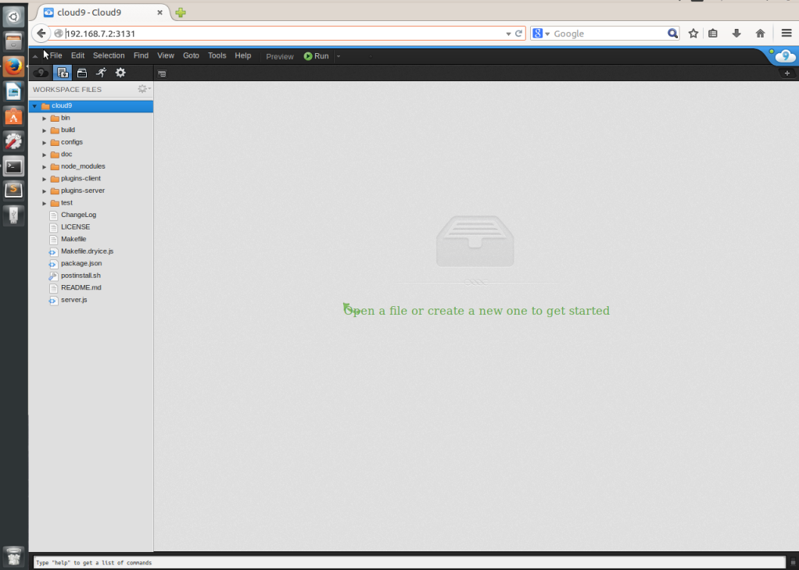

# Installing Cloud9 in your BBB

#####Prerequisites

In order to install Cloud9, you need some capabilities available in your board:

	- Internet connection through the board. You can fin [here] (https://github.com/erlerobot/erle_gitbook_basics_guide/tree/master/en/ip_forward) how to do it.
	- NodeJS >= 0.6.16 , NPM >= 1.1.16 and libxml2-dev. To install this: 
	
		`sudo apt-get install -y build-essential g++ curl libssl-dev apache2-utils git libxml2-dev`
	
###Installation

Execute the next commands, within the BBB:

`  git clone https://github.com/ajaxorg/cloud9.git
	cd cloud9
	npm install `
	
Once you have installed Cloud, this will take a while, execute the script to initialize the web server:

` cd bin
		sh cloud9.sh -l 0.0.0.0 `
		
You should see something like this in your shell:

Now you are able to access using a web browser. Type the IP direction ` 192.168.7.2:3131 ` and you should see this:

