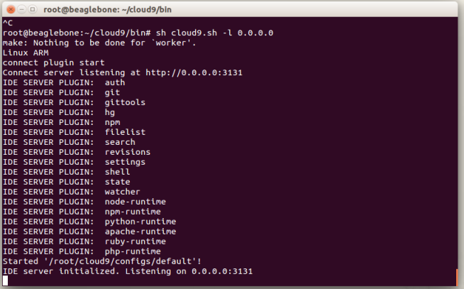

# Installing Cloud9 in your BBB

#####Prerequisites

In order to install Cloud9, you need some capabilities available in your board:

	- Internet connection through the board. You can fin [here] (https://github.com/erlerobot/erle_gitbook_basics_guide/tree/master/en/ip_forward) how to do it.
	- NodeJS >= 0.6.16 , NPM >= 1.1.16 and libxml2-dev. To install this: 
	` sudo apt-get install -y build-essential g++ curl libssl-dev apache2-utils git libxml2-dev `
	
###Installation

######Modifying NodeJS

A little fix is needed in order to run properly nodejs. Got to `./cloud9/configs/default.js ` and comment out the line
`./cloud9.ide.hg`

If you see that when you try to execute the software as it is said beyond, try this solutions:

`#Install Mercury`
`brew install hg `
`brew link mercurial --overwrite`

If this does not work, try the next step, removing nodejs, to install an older version.

######Remove Node JS and install older version

Remove Node JS if it is version is v0.10.x:

` sudo apt-get remove nodejs `

Download [node js] (http://nodejs.org/dist/v0.8.25/node-v0.8.25.tar.gz)
And untar it:

`tar -xvzf node-v0.8.25.tar.gz <directory_you_want> `

Finally, place yourself in the folder and:

`./configure`

`make`

`sudo make install `

*PS: Is good idea to compile it in your desktop instead of on the BeagleBone Black.

######Install Cloud9 and Bonescript

Execute the next commands, within the BBB:

`  git clone https://github.com/ajaxorg/cloud9.git
	cd cloud9
	npm install 
	npm install bonescript `
	
Once you have installed Cloud, this will take a while, execute the script to initialize the web server:

` cd bin
  sh cloud9.sh -l 0.0.0.0 `
		
You should see something like this in your shell:

Now you are able to access using a web browser. Type the IP direction ` 192.168.7.2:3131 ` and you should see this:

Sources:

https://github.com/ajaxorg/cloud9
http://dotnetdavid.wordpress.com/2013/09/16/beaglebone-black-cloud9-and-bonescript-install-guide/