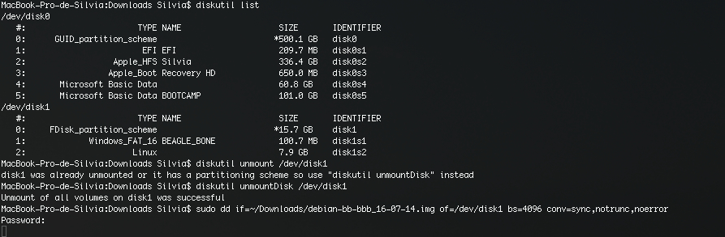

# Copy a Image to the SDcard

 Copiar una imagen a SDcard

#####Linux

In this [link](https://github.com/erlerobot/wiki/wiki/Copy-image-to-microSD-card) you can find how to copy the image to the SD using Linux.

Asumming that the image is called `erlerobot-ubuntu.img.gz`, and that the SDcard is mounted under` /dev/sdb` , type on your terminal:
```
zcat erlerobot-ubuntu.img.gz | sudo dd of=/dev/sdb bs=8M
```
To ensure that the image has been copied correctly, type
```
sync
```
#####Mac

In this OS you need to follow the following steps(showed in the image):



The process will late about 15-20 minutes.


After copying the image to the card (in any of both OS) check in Linux, taht you get  `BEAGLE_PILOT` and `rootfs` mounter.This can be done using the `mount` command.
