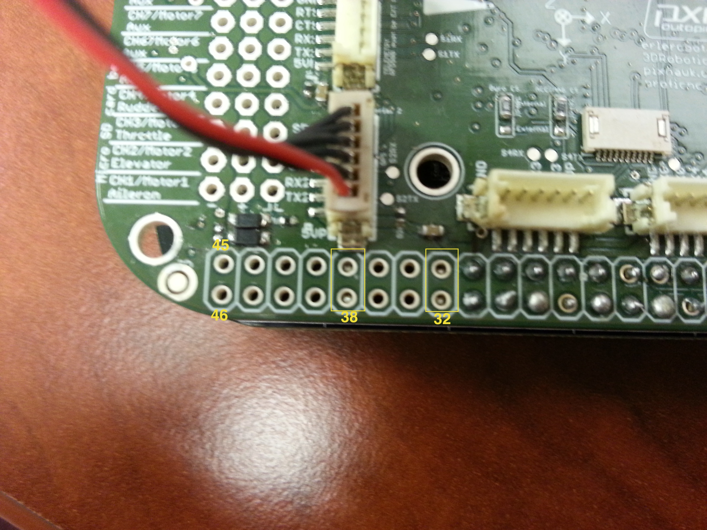

# GPS testing


The GPS test is done with the Gps connected to the serial 2, as indicated on the image:



Then, on el terminal connected tot he board , we type:
```
echo BB-UART5 > $SLOTS
```
And execute, for example arduCopter, with the following option(*-B /dev/ttyO5*):
```
build/ArduCopter.build-MPU9250/ArduCopter.elf -B /dev/ttyO5 -A tcp:*:6000:wait
```

For not typying the `echo BB-UART5 > $SLOTS` command every time we launch , ypu can add it to the end of the file `.bashrc`:
```
vi ~/.bashrc
```
We insert the command at the end (going down with the arrow,ESC,i)and keep changes (ESC, :wq).

Do :
```
source ~/.bashrc
```
to charge again.Like this, the next time we launch this command won't be neccesary and we will be able to launch ArduCopter with the option `-B...` indicated above.

To check that the GPS works do:
`status`o `watch gps_raw_int`, with the last one the values should move and adjust.
You can also do `screen /dev/ttyO5 57600` on the BBB and see starnge symbols.
