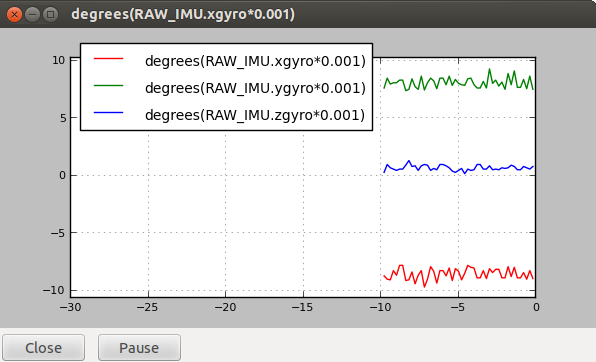
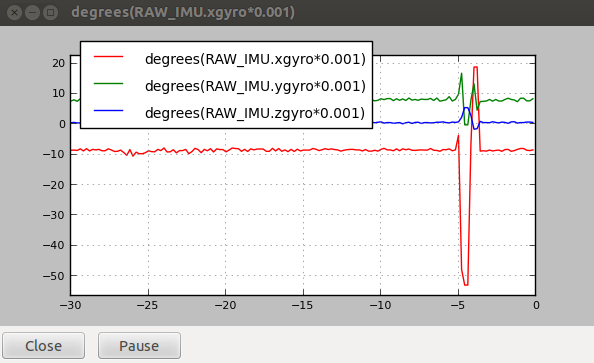

# Graph  the sensors

we need to download the `mavinit.scr` script, that contains some **alias** very useful. For downloading it , do the following:

```
wget http://tridge.github.io/MAVProxy/files/mavinit.scr
```

Execute `ArduCopter` in the BBB:

```
build/ArduCopter.build-MPU9250/ArduCopter.elf -A tcp:*:6000:wait
```

Now, Execute `mavproxy`:

```
mavproxy.py --master tcp:192.168.7.2:6000
```

When you can read in the prompted `Ready to FLY`, you can introduce commands in the `mavproxy console`.

Load the `mavinit.scr` script (previously downloaded)

```
script mavinit.scr
```

If we want to represent the accelerometer:

```
gaccel
```



If we want to represent the gyroscope:

```
ggyro
```


