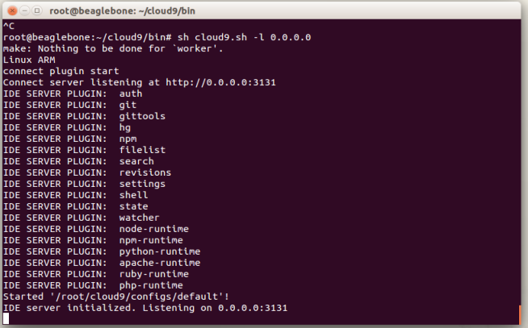
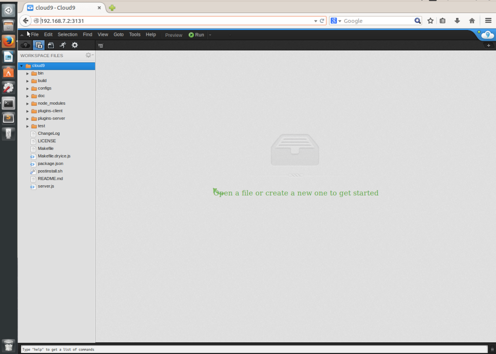

# Installing Cloud9 in your BBB

#####Prerequisites

Para instalar Cloud9 necesitas algunas cosas en tu placa:
	
	- Conexión a internet en la placa. Puedes encontrar información [aqui] de como hacerlo.
	- Internet connection through the board. You can fin [here] (en/ip_forward) how to do it.
	- NodeJS >= 0.6.16 , NPM >= 1.1.16 y libxml2-dev. para instalarlo: 
	` sudo apt-get install -y build-essential g++ curl libssl-dev apache2-utils git libxml2-dev `
	
###Intalación

######Modificando NodeJS

Una pequeña modificación es necesaria para ejecutar nodejs. Ve a `./cloud9/configs/default.js ` y comenta la linea:
`./cloud9.ide.hg`

Si ves esto cuando intentas ejecutarlo, intenta esta solución:

`#Install Mercury`
`brew install hg `
`brew link mercurial --overwrite`

Si no funciona, intenta el siguiente paso, eliminando nodejs e instalando una versión anterior.

######Eliminando Nose JS e instalando una versión anterior

Eliminando Node JS si la versión es v0.10.x:

` sudo apt-get remove nodejs `

Descargate [node js](http://nodejs.org/dist/v0.8.25/node-v0.8.25.tar.gz)
Descomprimelo:

`tar -xvzf node-v0.8.25.tar.gz <directory_you_want> `

Finalmente, situate en la carpeta y:

`./configure`

`make`

`sudo make install `

*PS: Es una buena idea compilarlo en tu Escritorio en lugar de la BeagleBone Black.

######Instalando Clooud9 y Bonescript

Ejecuta los siguientes comandos, en la BBB:

`  git clone https://github.com/ajaxorg/cloud9.git
	cd cloud9
	npm install 
	npm install bonescript `
	
Una vez que tengas instalado Cloud9, este llevará un tiempo, ejecuta el script que inicializa el servidor web:

` cd bin
  sh cloud9.sh -l 0.0.0.0 `
		
Deberías de ver algo como esto en tu shell:

Ahora debes de ser capaz de acceder usando un navegador web. Introduciendo la dirección IP  ` 192.168.7.2:3131 ` y deberías de ver algo como esto:

Fuentes:

https://github.com/ajaxorg/cloud9
http://dotnetdavid.wordpress.com/2013/09/16/beaglebone-black-cloud9-and-bonescript-install-guide/