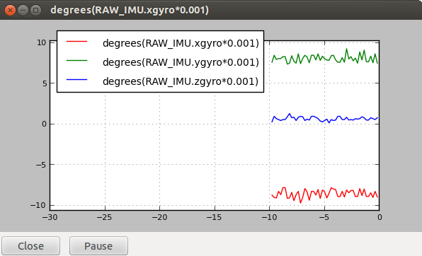
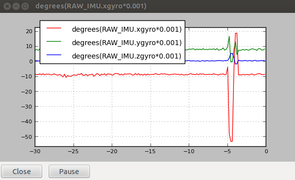

# Representación gráfico de los sensores.

Necesitaremos descargar el script `mavinit.scr`, en nuestra máquina, que contiene un conjunto de **alias** muy útiles. Para descargarla hacemos lo siguiente:

```
wget http://tridge.github.io/MAVProxy/files/mavinit.scr
```

Lanzamos `ArduCopter`en la BBB:

```
build/ArduCopter.build-MPU9250/ArduCopter.elf -A tcp:*:6000:wait
```

Ahora en nuestra máquina lanzamos `mavproxy`:

```
mavproxy.py --master tcp:192.168.7.2:6000
```

Cuando aparezca `Ready to FLY` se pueden comenzar a poner comandos en la consola que proporciona `mavproxy`.

Cargamos el script `mavinit.scr` descargado previamente:

```
script mavinit.scr
```

Si queremos representar el acelerometro:

```
gaccel
```



Si queremos representar el giroscopio:

```
ggyro
```


